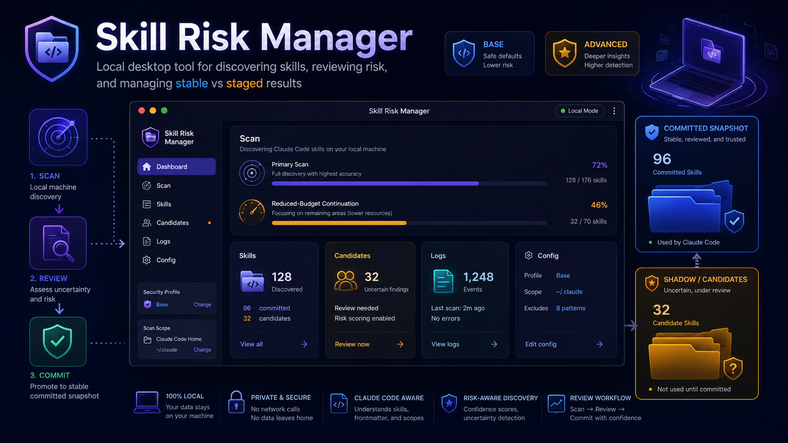

<div align="center">

# Skill Risk Manager

**Local-only desktop discovery, risk review, and staged trust management for Claude Code skills.**

<p align="center">
  
</p>

<p align="center">
  
  
  
  
  
</p>

</div>
# Background information

## In one sentence of what skill is
skill is a plug and play guideline that LLM can read a small amount of metadata and utilize that to further include more instructions from the skill to prevent context window overhead.

## How to locate the skill

Essentially a skill is just file, so theoratically it can appear anywhere on the computer
To confirm the skill's position, we have the following criteria: 
- the file is named `SKILL.md`,
- it lives under a `skills/<skill-name>/` folder,
- its frontmatter starts and ends with `---`,
- it has a `name`, and
- it has either a `description` or a `summary`.


# What the repo does

   Skill Risk Manager is a completely local Python desktop application for discovering and reviewing Claude Code skills across Windows, macOS, and Linux. It scans the local machine for Claude-related skills, commands, plugin files, and configuration files, separates high-confidence records from uncertain findings, attaches risk metadata, and provides a review workflow before questionable candidates are trusted or promoted.

   The project is designed around a local-only privacy model: scan results, logs, staged candidates, and reports remain on the user’s machine. The pipeline does not require network calls, telemetry, uploads, or remote APIs.

# How does the program works

   When the program starts, it runs a foreground discovery scan over high-confidence Claude locations, such as known Claude configuration paths and project-level `.claude` directories. Files that match the expected skill structure are treated as stable records and written into the committed scan snapshot.

   If a file looks related to Claude or agent skills but cannot be confidently classified, the program does not immediately trust it. For example, a file may be outside the expected `<project>/.claude` structure, may lack clear Markdown instruction content, or may only partially match the configured filename and path rules. These lower-confidence results are placed into a staged candidate pool for human review instead of being committed automatically.

   After the foreground scan completes, the program can continue with a lower-budget shadow scan. This deeper scan searches additional paths without blocking the interface, allowing the UI to show useful results early while still discovering uncertain or less obvious candidates in the background.

   For each confirmed record and staged candidate, the risk engine attaches metadata such as risk score, risk level, risk category, findings, and suggested action. These risk indicators are shown in the UI so the user can inspect each item, decide whether it should be trusted, ignored, exported, or promoted, and avoid polluting the trusted skill list with uncertain files.

# Run

Install dependencies:

```powershell
python -m pip install -r requirements.txt
```

Start the desktop app:

```powershell
python -m ui.app
```

---

## Test and backend cli for headless platforms

Run the full suite:

```powershell
python -B -m unittest discover -v
```

Syntax check:

```powershell
python -B -m compileall -q ui platform_manager skill_risk_manager tests
```

Run the backend CLI:

```powershell
python -m skill_risk_manager scan --stage1
python -m skill_risk_manager scan --stage1 --shadow
python -m skill_risk_manager list
python -m skill_risk_manager export-report .\report
```